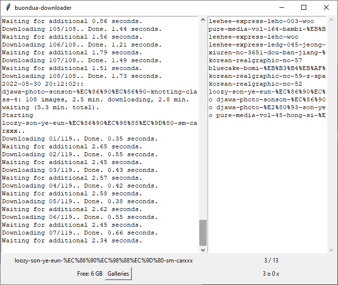

# :ribbon: Buondua Album Downloader

**Not safe for work (NSFW)**.  
A GUI program that lets you download albums with links from [buondua.com](https://buondua.com/).

**Usage (GUI):** Copy links from the website and it should queue them right up.

**Usage (CLI):**
```
# single link example
./buondua-tui.py link_to_buondua_album
./buondua-tui.py https://buondua.com/bluecake-bomi-%EB%B3%B4%EB%AF%B8-pink-dancer-73-photos-26163

# queueing a list of links from a text file example
./queue.sh list_of_links.txt
```
list_of_links.txt:
```
https://buondua.com/album-1
https://buondua.com/album-2
https://buondua.com/album-3
https://buondua.com/album-4
... etc.
```



## Donations
If you enjoy using this program and would like to support me, you could do so from the following cryptos:

 3Mmu2VonyQNLS5xobVKeNuhfgATYLkVtvM  
 0x79210DD85f4B7255752A507A4d23c6c843E56165
